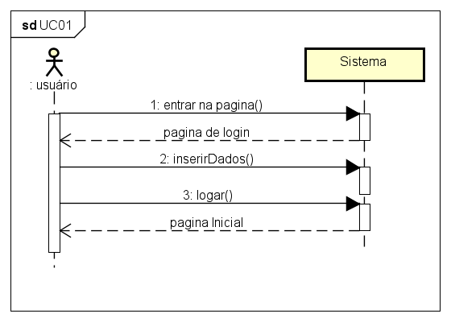
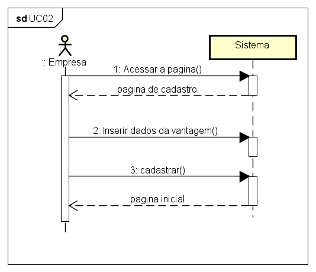
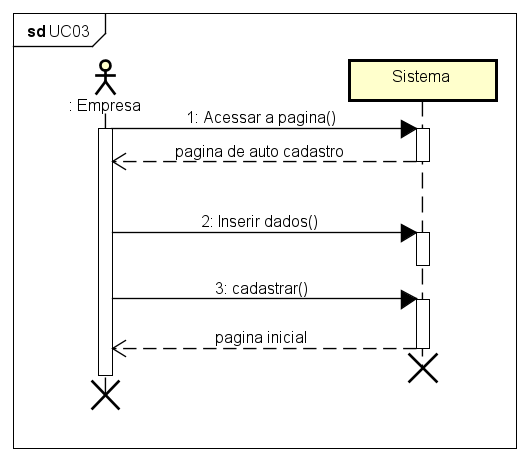
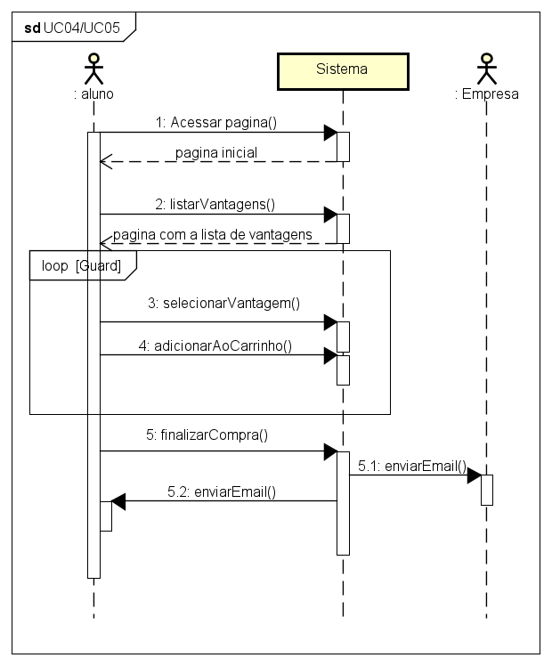
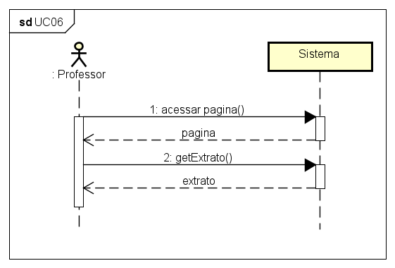
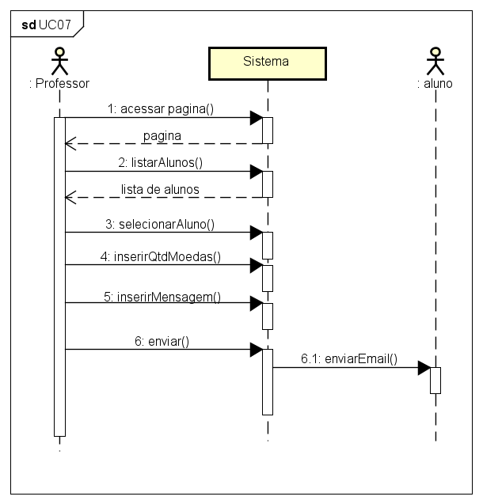

# Diagrama de caso de uso

# Histórias de Usuário

* US01: Como Aluno gostaria de fazer cadastro para usar o sistema.
* US02 :Como Aluno gostaria de usar o meu saldo disponível para resgatar vantagens.
* US03 :Como Aluno gostaria de consultar meu extrato para saber meus gastos e saldo.
* US04 :Como Professor gostaria de consultar meu extrato para saber meus gastos e saldo.
* US05 :Como Aluno gostaria de consultar minhas transações para saber meus histórico.
* US06 :Como Professor gostaria de consultar minhas transações para saber meus histórico.
* US07 :Como Professor gostaria de enviar moedas para meus alunos
* US08: Como Empresa gostaria de fazer cadastro para usar o sistema.
* US09: Como Empresa gostaria de cadastrar as vantagens para os alunos usarem.
* US10 :Como usário gostaria de fazer login para usar o sistema

# Diagrama de classe

# Mapeamento Entidade e Relacionamento

Legenda:
> primaryKey - @
> foreignKey - **negrito**

**_Endereco_**(@id, rua, bairro, numero, cep, **idUsuario**)

**_Usuario_**(@id, nome, email, senha, cpf, rg, cnpj, departamento, tipo, **idInstituicao**)

**_Transacao_**(@id, valor, descricao, **idContaOrigem**, **idContaDestino**)

**_Conta_**(@id, saldo, **idUsuario**)

**_Vantagem_**(@id, produto, valor, descricao, **idEmpresa**)

**_Compra_**(@id, valorTotal, **idAluno**)

**_ItemCompra_**(@id, **idCompra**, **idVantagem**)

**_Instituicao_**(@id, nome)

# Diagrama de Componente

# Diagrama de Implantação

# Diagramas de Sequencia do Sistema

## UC01

## UC02

## UC03

## UC04/UC05

## UC06

## UC07

